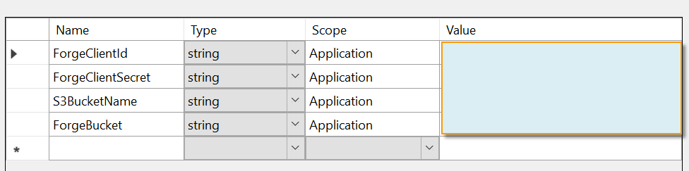
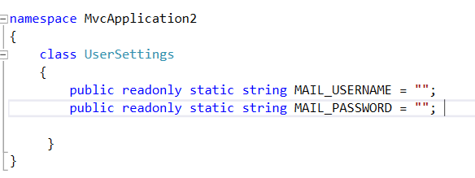
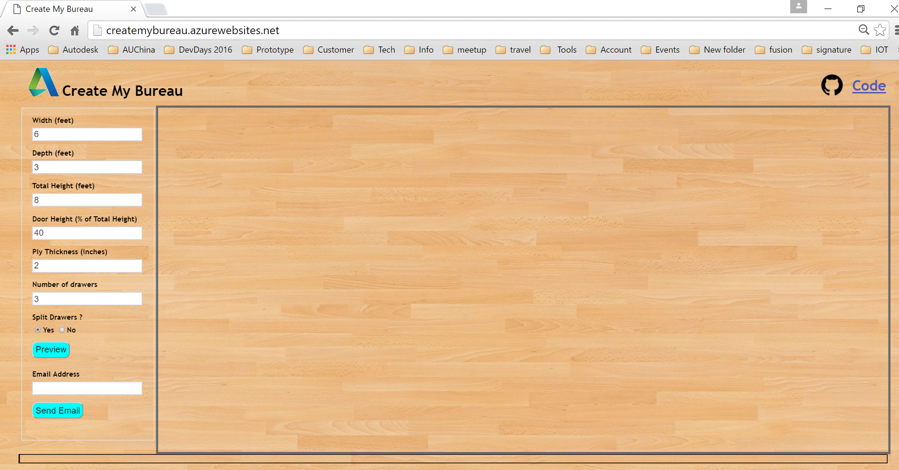
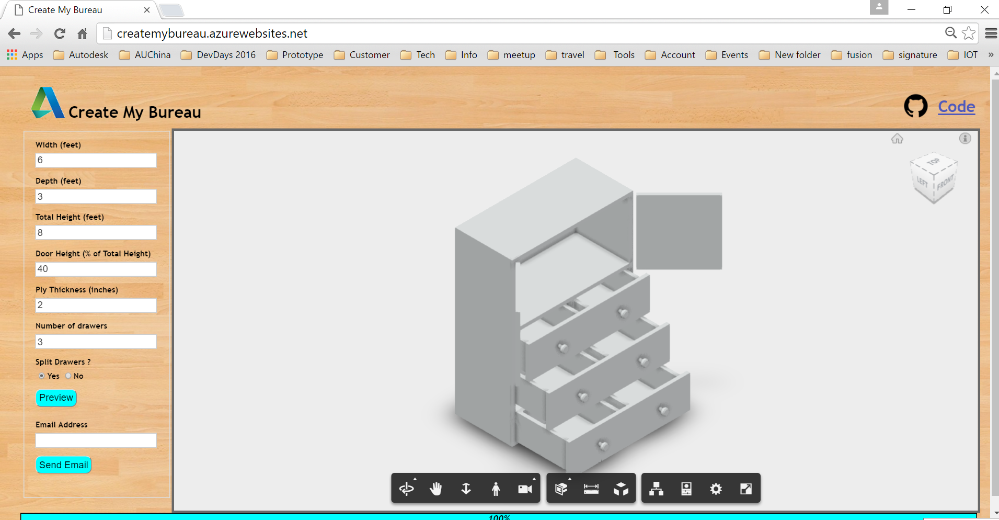

Design Automation ASP.net Cabinet Sample
=============================

(Formely AutoCAD I/O)

##Description

An ASP.Net Web application that uses Design Automation and Viewer API to preview and create a closet drawing by customization.

##Dependencies
* As this sample includes a reference to  [design.automation-.net-library](https://github.com/Developer-Autodesk/design.automation-.net-library), please build that sample and get the class binary.  
* Visual Studio 2012. 2013 or 2015. The latest test is on VS2015.
* Get [credentials of AWS](http://docs.aws.amazon.com/general/latest/gr/aws-security-credentials.html) and create one S3 bucket
* Get your credentials (client key and client secret) of Design Automation at http://developer.autodesk.com 
* [ObjectARX SDK] (http://usa.autodesk.com/adsk/servlet/index?siteID=123112&id=773204). The SDK version depends on which AutoCAD verison you want to test with the AppPackage locally. In current test, the version is AutoCAD 2016.

##Setup/Usage Instructions
* Firstly, test the workflow of package and workitem by Windows console program [Custom-Apppackage](CreateCloset.bundle/Custom-Apppackage)
  * open the solution [Custom-Apppackage](CreateCloset.bundle/Custom-Apppackage)
  * Unzip [ObjectARX SDK] (http://usa.autodesk.com/adsk/servlet/index?siteID=123112&id=773204). Add AcCoreMgd, AcDbMgd from SDK/inc to the project *CustomPlugin*
  * Build project *CustomPlugin*. It is better to test with local AutoCAD to verify the custom command
  * Restore the packages of project **Client** by [NuGet](https://www.nuget.org/). The simplest way is to right click the project>>"Manage NuGet Packages for Solution" >> "Restore" (top right of dialog)
  * Add other refererences in they are missing
  * input your client key and client secret of Design Automation in line 19 and 20 of [Program.cs](./CreateCloset.bundle/Custom-Apppackage/Program.cs).
  * Build the solution and run the solution
  * Verify the whole process is working, and if a final drawing will be generated. 
  * The scripts used by the custom activities like  below
                        Script = "_tilemode\n1\n_filedia\n0\nCreateCloset\n6\n3\n8\n2\n40\n3\n1\n_.VSCURRENT\nsketchy\n_.Zoom\nExtents\n_.SaveAs\n\nResult.dwg\n"
* run   [Program.cs](./CreateCloset.bundle/Custom-Apppackage/Program.cs) and verify the activity works well
* you can also use aother program of design automation to create an activity 

The script used by the CreateCloset activity makes use of a custom command named “CreateCloset” which is provided by *CustomPlugin*. The  CreateCloset activity will bind the package. 

*  Open the solution [AutoCADIODemoWebApp.sln](AutoCADIODemoWebApp.sln). 
*  Restore the packages of project **Client** by [NuGet](https://www.nuget.org/). The simplest way is to right click the project>>"Manage NuGet Packages for Solution" >> "Restore" (top right of dialog)
*  Add other refererences in they are missing
*  input your client key and client secret of Forge (this assumes the credential has been authorized  with Design Automation, Data Management, Model Derivitive), and AWS S3 bucket name in the project setting
    [] 

* input your AWS key and secret in [Web.config](Web.config).
    []  

  * Also provide your email credentials. 
    This will allow this web application to send the drawing as an attachment in an email.

   * Build the sample project
  Host the web app or run it locally. This will display the web page as shown in below screenshot :

   

  * Change the closet parameters as needed.
      Click on “Preview” button
      This generates a drawing with the closet model using AutoCAD Automation and the drawing is loaded in the viewer
      as shown in below screenshot.

  * Click on “Send Email” button
  This generate a drawing with the closet model using AutoCAD Design Automation and this drawing is emailed as an attachment
  to the email id provided. A screenshot of the email that is sent is shown below.

  
  
  
# License

This sample is licensed under the terms of the [MIT License](http://opensource.org/licenses/MIT).
Please see the [LICENSE](LICENSE) file for full details.

## Written by

[Balaji Ramamoorthy](https://github.com/BalajiRamamoorthy). Maintained by [Xiaodong Liang](https://github.com/xiaodongliang/) [Forge Partner Development](http://forge.autodesk.com)
